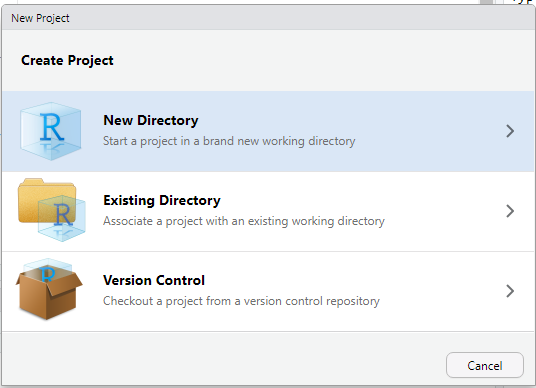
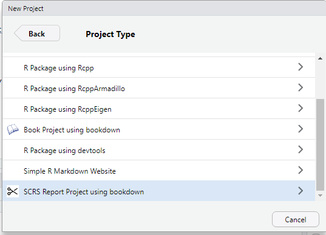

# scrsreport

[](https://travis-ci.org/scrs-msu/scrsreport)
 
What does `scrsreport` do?
==========================

scrsreport adds a SCRS statistical report template to [RStudio](https://www.rstudio.com/) (>= 1.1.28) when 
you click "New Project... -> New Directory". It creates a bookdown skeleton with
gitbook (HTML) and pdfbook (PDF) templates matched with SCRS report templates
originally created in 2016. This will help all reports have a consistent,
professional look, as well as utilizing the benefits of bookdown (which is an
enhanced version of R Markdown) including cross-referecens (section, figures, 
tables), citations, and math equations.

Installation
============

You need `devtools` package to install this package directly from its GitHub repo.

```
devtools::install_github("scrs-msu/scrsreport")
```

It will install all dependencies including [`bookdown`](https://github.com/rstudio/bookdown) and its dependencies. You may be asked to update your existing packages if needed.

Usage
=====

This package does not have any public function you can call or documentation you can read. In fact, you hardly see any difference unless you do the following:

* In Rstudio, click on New Project icon in RStudio or File - New Project...
* In Create Project window, choose *New Directory*
* In Project Type window, you will see *SCRS Report Project using bookdown* with the SCRS icon
* Type the project name and the folder you want to create the project in

 

A new project with a set of template files will be created. The three most important files will be already open in the Source pane:

* **README.rd**: the README file where you give a short description of what project is about
* **_output.yml**: the configurations for the HTML format (`bookdown::gitbook`) and PDF format (`bookdown::pdf_book`). The phrase *Most Important Study* should be changed to the title of the report (that matches the title in **index.Rmd** file. 
* **index.Rmd**: the main R Markdown file. This is a regular R Markdown file with a populated YAML header. 
  * **title**: The title of the report. It should match with the title in **_output.yml**.
  * **author**: Primary statistician's name with their degree abbreviation.
  * **client**: Client's name with their degree abbreviation.
  * **director**: SCRS Director's name with their degree abbreviation.
  * **secondary**: Secondary statistician(s)' names with their degree abbreviation.
  * **prelim**: *yes* if it is a draft ("draft" will be added to title as well as a disclaimer), and *no* if it is the final version.
  * **date**: pre-populated to generate the date of report compilation.
  * **titlepage**: *yes* to include the title page, *no* to remove it.
  * **msucolor**: *yes* to use blue and gold as the color theme of the report.
  * **twoside** (only applied to PDF version): affects the header and page margins to fit two-sided prints.
  * **spacing** (only applied to PDF version): the number of spaces between lines.
  * **bibliography**: name of the BibTeX file.
  * **biblio-style** (only applied to PDF version): citation style. Default is American Psychological Association (APA) style. 
    * *Note*: citation style for the gitbook HTML is defined in **_output.yml** (`pandoc_args`). You can download the citation style at [citation-style-language](https://github.com/citation-style-language/styles) project and change the path and file name in **_output.yml** accordingly.
  * **link-citations**: whether to create a link at the citation to the corresponding bibliography item.
  * **colorlinks** (only applied to PDF version): whether to color URLs in the PDF version.
  * **site**: tell RStudio to treat the project as a bookdown project (changes in Build pane, Addins, etc.).
  * **documentclass** (only applied to PDF version): treat the document as the LaTeX article class, then "Chapter" will not be used at the first level header.
  
Why bookdown?
=============

Several generations of SCRS research assistants have developed and maintained several templates for a good-looking statistical report. The LaTeX style file was first created by Michael Lerch in 2015. In 2017, Kenneth Flagg and Jordan Schupbach created two sets of templates for R Markdown documents, one for PDF compilation and another for HTML compilation. Since then, Flagg and Tan Tran have refined and updated the templates to reflect changes in SCRS' support grant, SCRS logos, and the periods when SCRS had a co-director and an assistant director. As of September 2019, there were three separate report templates in the [Box Templates and Tools folder (internal link)](https://montana.app.box.com/folder/49004143798), making it tedious to use, train, and modify when needed. Also, reverting a report originally written for one format to another format is not simple because of the difference in the source file (LaTeX knitr vs. R Markdown). Moreover, since 2018, SCRS decided to offer an HTML version of draft reports to clients instead of PDF because of its many benefits, such as it can display visualizations without the limit of a paper, it is easier for the clients to re-use figures and R codes. However, R Markdown has many shortcomings and annoying bugs when writing professional documents (figure referencing, equations, citations, etc.).

[bookdown](https://bookdown.org/) is an [open-source project](https://github.com/rstudio/bookdown) that is built on R, Markdown, and pandoc by [Yihui Xie](https://yihui.name/). It aims to facilitate writing professional documents with the ability to compile one source file to multiple output formats (PDF, HTML, EPUB, Word, etc.). The strengths of bookdown that suits the purpose of a SCRS HTML report include, but not limited to:

* Write your report in simple Markdown markups.
* Writing equations in LaTeX syntax with consistent and stable results.
* Cross-references are implemented for equations, theorems, figures, tables, and sections.
* Citations with BibTeX.
* PDF version of the report can be created if needed.
* HTML and PDF templates can be used to create a nice typesetting report.

Known Bugs and Missing Features
===============================

* RStudio has a bug that prevents it to display the compiled gitbook correctly when a single HTML document is generated (projectname.html) instead of multiple HTML documents with index.html is the portal as bookdown is originally designed for. See [Issue #5371 in rstudio/rstudio](https://github.com/rstudio/rstudio/issues/5371). Currently, you have to view it in an external browser by clicking on "Open in Browser".
* [Collapsible code chunk option](https://yihui.name/knitr/options/#text-results) in knitr that works in R Markdown does not work in bookdown. A workaround is to employ the answer in [this StackOverFlow question](https://stackoverflow.com/questions/45360998/code-folding-in-bookdown) or write your report in [R Notebook](https://bookdown.org/yihui/rmarkdown/notebook.html) instead. **This feature may be added to `scrsreport` in the next release.**


Further Readings
================
  * [bookdown home page](https://bookdown.org/)
  * [bookdown: Authoring Books and Technical Documents with R Markdown](https://bookdown.org/yihui/bookdown/)
  * [The Wikipedia page on BibTeX](https://en.wikipedia.org/wiki/BibTeX)
  
